# HopeCMS — E2E Test Execution Guide

**Sprint:** 3 Final  
**Tester:** M5 – QA / Documentation Specialist  
**Date Executed:** May 9, 2026
**Production URL:** https://hope-inc-customer-management-system.vercel.app  
**Commit SHA (main):** 0fafa53  
**Browser:** Google Chrome (latest)  
**Overall Result:** ✅ PASS

---

## Pre-Test Checklist

Before starting, confirm the following are ready:

- [ ] Production URL is live and loads the login page
- [ ] SUPERADMIN account is active and credentials are known
- [ ] ADMIN account is active and credentials are known
- [ ] USER account is active and credentials are known
- [ ] A fresh unregistered email address is ready for TC-01
- [ ] Supabase Dashboard is open in a separate tab (for DB verification)
- [ ] Screenshot tool is ready (Win+Shift+S on Windows, Cmd+Shift+4 on Mac)
- [ ] This document is open alongside the browser for live fill-in

> 💡 **Golden rule:** Fill in PASS/FAIL and paste the screenshot immediately after each test. Do not batch at the end.

---

## Test Accounts

| Label | Email | Role | Status |
|-------|-------|------|--------|
| SUPERADMIN | klynezyro.reyes@neu.edu.ph | SUPERADMIN | ACTIVE |
| ADMIN | klynezyroreyes@gmail.com | ADMIN | ACTIVE |
| USER | klynezyroreyes@gmail.com | USER | ACTIVE |
| INACTIVE USER | klynezyroreyes@gmail.com | USER | INACTIVE |

---

## Round 1 — Unauthenticated / Registration Tests

> Open a **fresh incognito window** for this round.

---

### TC-01 · Email Registration — New User Provisioned as USER / INACTIVE

**Steps:**
1. Navigate to the production URL in incognito.
2. Click **Create Account** at the bottom of the login card.
3. Fill in: First Name, Last Name, Username, Email (new unused address), Password.
4. Check the Terms of Service checkbox.
5. Click **Create Account**.
6. Open Supabase Dashboard → Table Editor → `user` table → verify the new row.

**Expected:**
- New row exists with `user_type = USER` and `record_status = INACTIVE`
- 9 rows created in `UserModule_Rights` (view rights = 1, CRUD rights = 0)

**Screenshot:**


> `[SCREENSHOT: Supabase user table showing new INACTIVE row]`

**Result:** ✅ PASS
**Notes:** Works perfectly as intended

---

### TC-02 · Login Guard Blocks INACTIVE Account

**Steps:**
1. Stay in the same incognito window.
2. Attempt to Sign In with the account just created in TC-01.

**Expected:**
- Login is blocked
- Activation-pending message is displayed

**Screenshot:**


**Result:** ✅ PASS  
**Notes:** Works perfectly as intended
---

### TC-03 · Google OAuth — New User Created as USER / INACTIVE

**Steps:**
1. Open a second incognito window.
2. Click **Continue with Google** using a Google account not yet registered in the system.
3. Complete the Google consent screen.
4. Check Supabase → `user` table → verify new row.

**Expected:**
- New `USER / INACTIVE` row created in Supabase
- Login is blocked with activation-pending message after redirect

**Screenshot:**
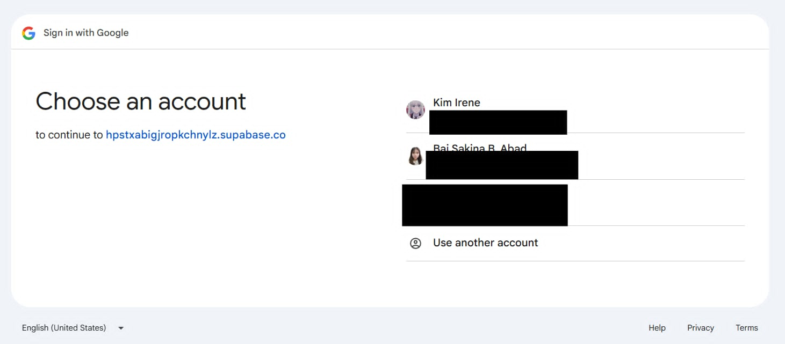


**Result:** ✅ PASS  
**Notes:** Works perfectly as intended

---

## Round 2 — Logged in as USER

> Sign in with the active USER account. Keep this window open throughout this round.

---

### TC-04 · Successful USER Login — Correct Landing Page and Sidebar

**Steps:**
1. Sign In with the USER account.

**Expected:**
- Redirected to Customer Registry
- Sidebar shows: **Customers, Sales, Products** only (no Dashboard, Users, Deleted Customers, Logs)
- Access Policy banner says: *"You are currently operating under User Access."*

**Screenshot:**


**Result:** ✅ PASS  
**Notes:** Works perfectly as intended

---

### TC-05 · USER — No Mutation Buttons on Customer Registry

**Steps:**
1. Observe the Customer Registry page as USER.

**Expected:**
- No **+ Add Customer** button
- No **Edit** or **Delete** in the `···` actions menu (only **View Sales** / **Hide Sales**)
- No **Stamp** column in the table

**Screenshot:**


**Result:** ✅ PASS  
**Notes:** Works perfectly as intended

---

### TC-06 · USER — Blocked from /deleted-customers Route

**Steps:**
1. While logged in as USER, navigate to:
   `https://hope-inc-customer-management-system.vercel.app/#/deleted-customers`

**Expected:**
- Route is blocked — Customer Registry is displayed instead
- Deleted Customers link does not appear in the sidebar

**Screenshot:**
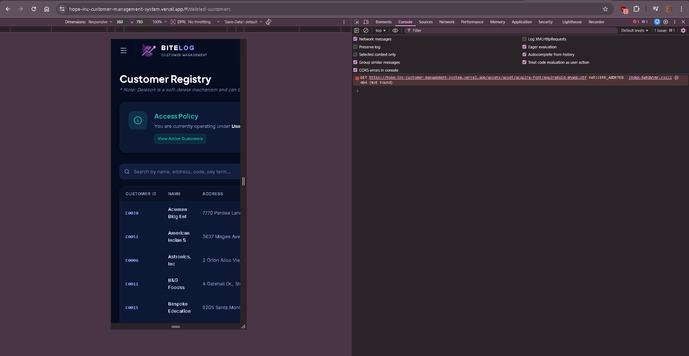

**Result:** ✅ PASS
**Notes:** Hash router intercepts the protected route and renders 
Customer Registry instead. Deleted Customers content is never shown 
to USER. Route guard confirmed working.

---

### TC-07 · USER — Sales Page is Read-Only

**Steps:**
1. Navigate to **Sales** in the sidebar.

**Expected:**
- Sales Transactions page loads
- Zero Add, Edit, or Delete buttons anywhere on the page
- Subtitle reads: *"View customer transaction history (read-only access)"*

**Screenshot:**


**Result:** ✅ PASS  
**Notes:** Works perfectly as intended

---

### TC-08 · USER — Products Page is Read-Only

**Steps:**
1. Navigate to **Products** in the sidebar.

**Expected:**
- Product Catalogue loads
- Zero Add, Edit, or Delete buttons
- Only **View** buttons in the History column (for price history)

**Screenshot:**


**Result:** ✅ PASS  
**Notes:** Works perfectly as intended

---

### TC-09 · USER — RLS Blocks INACTIVE Customers via Network Tab

**Steps:**
1. Press **F12** → open the **Network** tab.
2. Refresh the Customer Registry page.
3. Find the API call to the `customer` table (look for a request containing `customer` in the URL).
4. Click the request → go to the **Response** tab.
5. Inspect the JSON — check if any rows have `record_status: "INACTIVE"`.

**Expected:**
- Zero rows with `record_status: "INACTIVE"` in the response
- RLS filters them out at the database level

**Screenshot:**


**Result:** ✅ PASS  
**Notes:** Works perfectly as intended

---

### TC-10 · Sales Drill-Down — View Sales Inline (as USER)

**Steps:**
1. On the Customer Registry, find any customer that has sales data.
2. Click `···` → **View Sales**.
3. Observe the inline expansion below the customer row.
4. Note the columns and line items displayed.

**Expected:**
- Sales History panel expands inline (no page navigation)
- Shows: Transaction No, Date, Facilitated By, Grand Total
- Line items show: Product name (product code), Qty, Price, Subtotal
- Green **Total Sales** row at the bottom
- No Add, Edit, or Delete buttons anywhere in the expanded panel

**Screenshot:**


**Result:** ✅ PASS  
**Notes:** Works perfectly as intended

---

## Round 3 — Logged in as ADMIN

> Sign in with the ADMIN account.

---

### TC-11 · ADMIN — Correct Landing Page and Sidebar

**Steps:**
1. Sign In as ADMIN. Observe landing page and sidebar.

**Expected:**
- Lands on **Customer Registry** (no Dashboard)
- Sidebar shows: Customers, Sales, Products, Users, Deleted Customers, Logs
- Access Policy banner says: *"Admin Access"* with tags: View Active Customers, View Audit Stamps, Add Customers, Edit Customers

**Screenshot:**


**Result:** ✅ PASS  
**Notes:** Works perfectly as intended

---

### TC-12 · ADMIN — Add Customer

**Steps:**
1. Click **+ Add Customer**.
2. Fill in: Customer Name = `Test Corp`, Address = `123 Test Street, Test City`, Payment Term = `COD`.
3. Note that Customer No is **auto-assigned**.
4. Click **Add Customer**.

**Expected:**
- New customer `Test Corp` appears in the list immediately
- Customer No is assigned by the system (e.g., C0085)
- Supabase `customer` table has new row with `record_status = ACTIVE`

**Screenshot:**


**Result:** ✅ PASS  
**Notes:** Works perfectly as intended

---

### TC-13 · ADMIN — Edit Customer

**Steps:**
1. Find `Test Corp` in the list.
2. Click `···` → **Edit**.
3. Change the address to `456 Updated Ave, New City`.
4. Click **Save**.

**Expected:**
- Row updates immediately in the UI
- Stamp column updates to reflect the edit (e.g., `Updated by ADMIN:... @ ...`)

**Screenshot:**


**Result:** ✅ PASS  
**Notes:** Works perfectly as intended

---

### TC-14 · ADMIN — No Delete Option in Actions Menu

**Steps:**
1. Click `···` on any customer row.
2. Observe the menu options.

**Expected:**
- Menu shows: **View Sales**, **Edit** only
- No **Delete** option

**Screenshot:**


**Result:** ✅ PASS  
**Notes:** Works perfectly as intended

---

### TC-15 · ADMIN — Sales Page is Read-Only

**Steps:**
1. Navigate to **Sales**.

**Expected:**
- Zero mutation buttons (no Add, Edit, Delete)
- **View Details** / **Hide Details** buttons only

**Screenshot:**


**Result:** ✅ PASS  
**Notes:** Works perfectly as intended

---

### TC-16 · ADMIN — Products Page is Read-Only

**Steps:**
1. Navigate to **Products**.

**Expected:**
- Zero mutation buttons
- Only **View** buttons in the History column

**Screenshot:**


**Result:** ✅ PASS  
**Notes:** Works perfectly as intended

---

### TC-17 · ADMIN — Activate a USER Account

**Steps:**
1. Navigate to **Users**.
2. Find the INACTIVE test account from TC-01 (or the pre-seeded INACTIVE USER).
3. Click `···` → **Activate**.
4. Confirm the dialog: *"[username] will be marked as ACTIVE."*

**Expected:**
- Status changes to **ACTIVE** in the table
- User can now sign in

**Screenshot:**


**Result:** ✅ PASS  
**Notes:** Works perfectly as intended

---

### TC-18 · ADMIN — Cannot Deactivate Users

**Steps:**
1. Click `···` on any ACTIVE USER row.
2. Observe the menu options.

**Expected:**
- Menu shows: **View Permissions**, **Activate** only
- No **Deactivate** option

**Screenshot:**


**Result:** ✅ PASS  
**Notes:** Works perfectly as intended

---

### TC-19 · ADMIN — View Permissions Modal is Read-Only

**Steps:**
1. Click `···` → **View Permissions** on any USER.
2. Inspect the modal.

**Expected:**
- Modal opens with **Read-only** badge in top-right corner
- Tabs: Customer, Sales, Product, Admin
- Toggle switches are visible but **cannot be changed**

**Screenshot:**


**Result:** ✅ PASS  
**Notes:** Works perfectly as intended

---

### TC-20 · ADMIN — SUPERADMIN Rows Show No Actions

**Steps:**
1. In the User Registry, locate any row with Role = **SUPERADMIN**.
2. Observe the Actions column.

**Expected:**
- Actions column shows `—` (dash)
- No `···` menu appears on SUPERADMIN rows

**Screenshot:**


**Result:** ✅ PASS  
**Notes:** Works perfectly as intended

---

### TC-21 · ADMIN — Audit Logs Accessible

**Steps:**
1. Navigate to **Logs** in the sidebar.

**Expected:**
- Audit Logs page loads with full event history
- Colored action badges visible (DELETED, RESTORED, ACTIVATED, etc.)

**Screenshot:**


**Result:** ✅ PASS  
**Notes:** Works perfectly as intended

---

## Round 4 — Logged in as SUPERADMIN

> Sign in with the SUPERADMIN account.

---

### TC-22 · SUPERADMIN — Correct Landing Page and Sidebar

**Steps:**
1. Sign In as SUPERADMIN. Observe landing page and sidebar.

**Expected:**
- Lands on **Dashboard** (not Customer Registry)
- Sidebar shows: Dashboard, Customers, Sales, Products, Users, Deleted Customers, Logs

**Screenshot:**


**Result:** ✅ PASS  
**Notes:** Works perfectly as intended

---

### TC-23 · SUPERADMIN — Dashboard Loads All Analytics

**Steps:**
1. Observe the full Dashboard page.
2. Click the **Pending Activation** button (yellow, top-right).

**Expected:**
- Stat cards visible: Total Revenue, Products Sold, Total Transactions, Registered Customers
- Pending Activation modal opens listing INACTIVE accounts with their role + status badge
- Top 5 Customers table visible
- Product Revenue Breakdown visible
- Customer Sales Summary table visible (paginated)

**Screenshot:**


**Result:** ✅ PASS  
**Notes:** Works perfectly as intended

---

### TC-24 · SUPERADMIN — Soft-Delete Customer

**Steps:**
1. Navigate to **Customers**. Find `Test Corp` (created in TC-12).
2. Click `···` — note that **Delete** option is now visible.
3. Click **Delete**.
4. Confirm the dialog: *"This will soft-delete the customer 'Test Corp'..."*
5. Check Supabase → confirm `record_status = INACTIVE`.

**Expected:**
- `Test Corp` disappears from the Customer Registry
- Supabase row shows `record_status = INACTIVE`
- Stamp updated with deletion audit string

**Screenshot:**


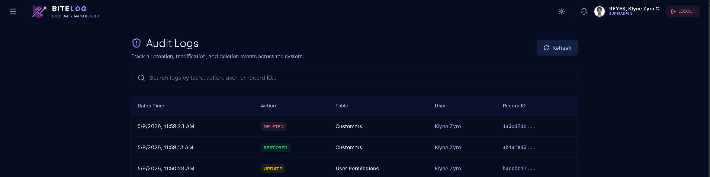

**Result:** ✅ PASS  
**Notes:** Works perfectly as intended

---

### TC-25 · USER Cannot See Soft-Deleted Customer

**Steps:**
1. Open a new incognito window. Sign in as USER.
2. Navigate to Customer Registry.
3. Search for `Test Corp`.

**Expected:**
- No results found — `Test Corp` is completely invisible to USER

**Screenshot:**
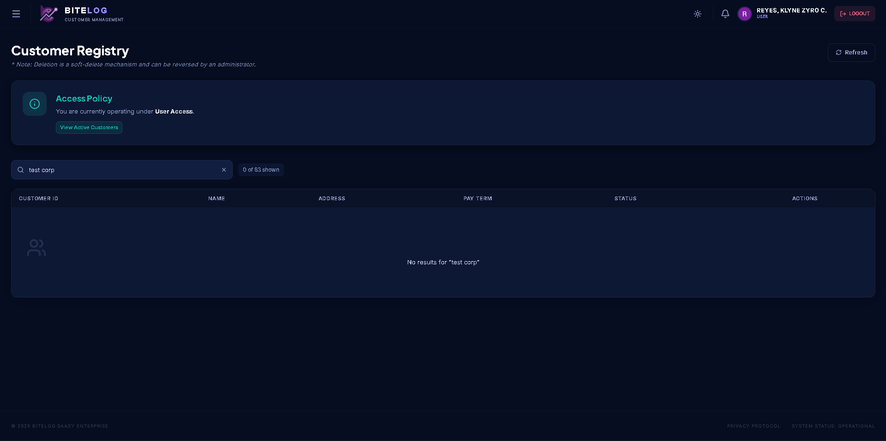

**Result:** ✅ PASS  
**Notes:** Works perfectly as intended

---

### TC-26 · Deleted Customers Panel Shows Soft-Deleted Record

**Steps:**
1. Back in the SUPERADMIN window, navigate to **Deleted Customers**.

**Expected:**
- `Test Corp` appears in the list with `INACTIVE` badge
- Stamp column shows the deletion audit string

**Screenshot:**
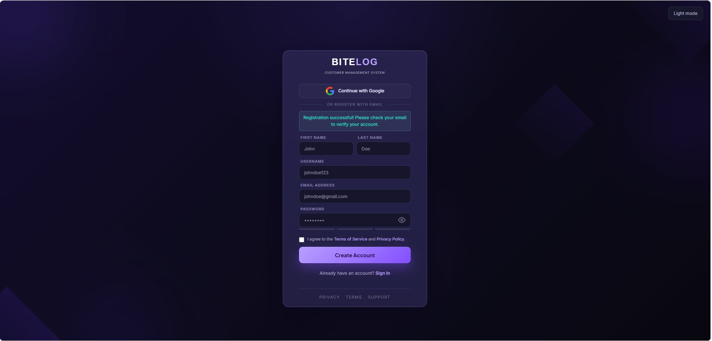

**Result:** ✅ PASS  
**Notes:** Works perfectly as intended

---

### TC-27 · Restore Soft-Deleted Customer

**Steps:**
1. On the Deleted Customers page, click **Restore** on `Test Corp`.
2. Confirm the dialog: *"Test Corp will be restored to its previous state (ACTIVE)."*
3. Navigate back to Customer Registry.
4. Switch to USER account and verify.

**Expected:**
- `Test Corp` disappears from Deleted Customers list
- `Test Corp` reappears in the main Customer Registry
- USER can now see `Test Corp` again

**Screenshot:**
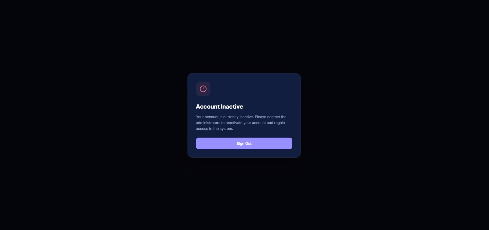

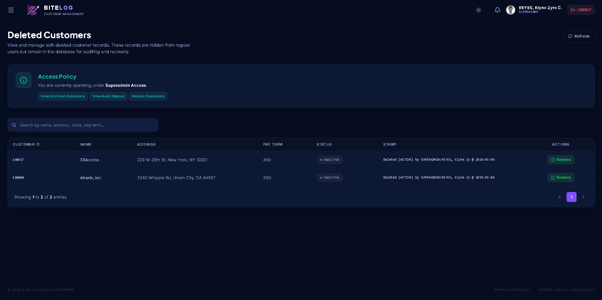

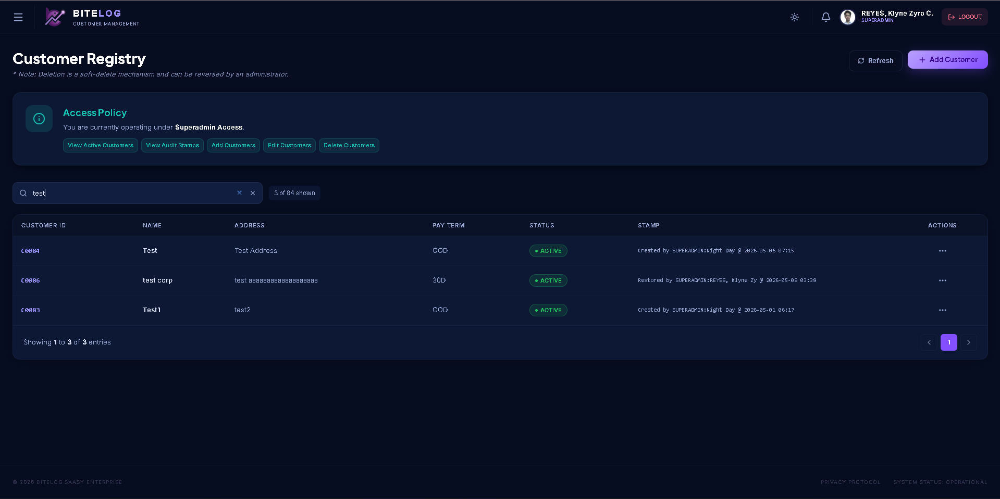

**Result:** ✅ PASS  
**Notes:** Works perfectly as intended

---

### TC-28 · Sales Drill-Down — Full Flow (SUPERADMIN)

**Steps:**
1. Navigate to **Customers**. Find any customer with sales data.
2. Click `···` → **View Sales**.
3. Observe the inline Sales History expansion.
4. Navigate to the **Sales** page.
5. Click **View Details** on any transaction.

**Expected:**
- Inline expansion shows: Transaction No, Date, Facilitated By, Grand Total + line items (Product, Qty, Price, Subtotal, Total Sales)
- Sales page shows Transaction No, Customer, Date, Facilitated By, Total, View Details button
- Expanded transaction shows: Product Code, Description, Qty, Unit Price, Total with *"Total Items: X"* count
- Zero mutation buttons anywhere on both pages

**Screenshot:**
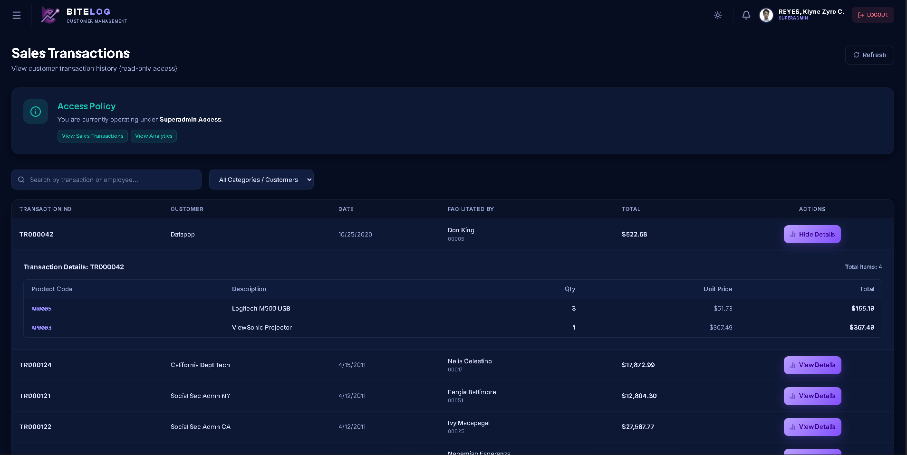

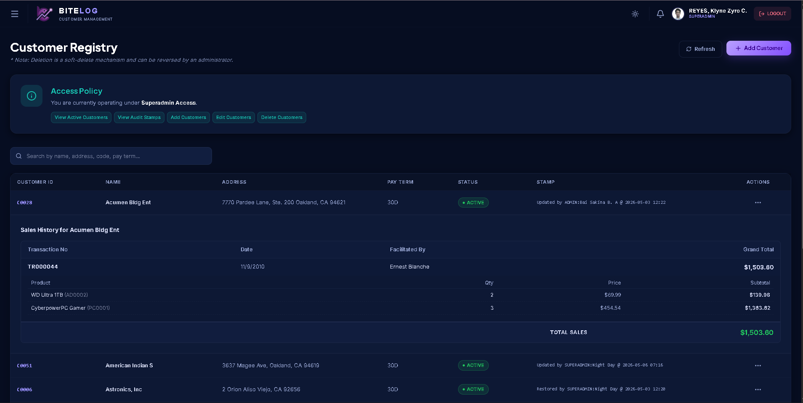

**Result:** ✅ PASS  
**Notes:** Works perfectly as intended

---

### TC-29 · Products Page Read-Only (SUPERADMIN)

**Steps:**
1. Navigate to **Products**.
2. Click **View** on any product's History column.

**Expected:**
- Zero mutation buttons on the Products page
- Price History modal opens showing: Effective Date, Price, Status (Current badge)

**Screenshot:**
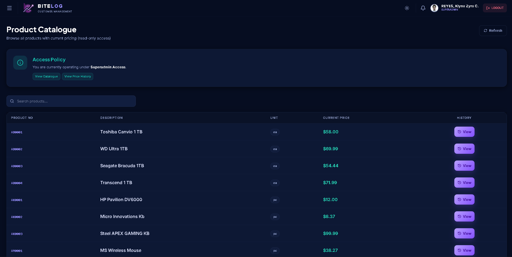

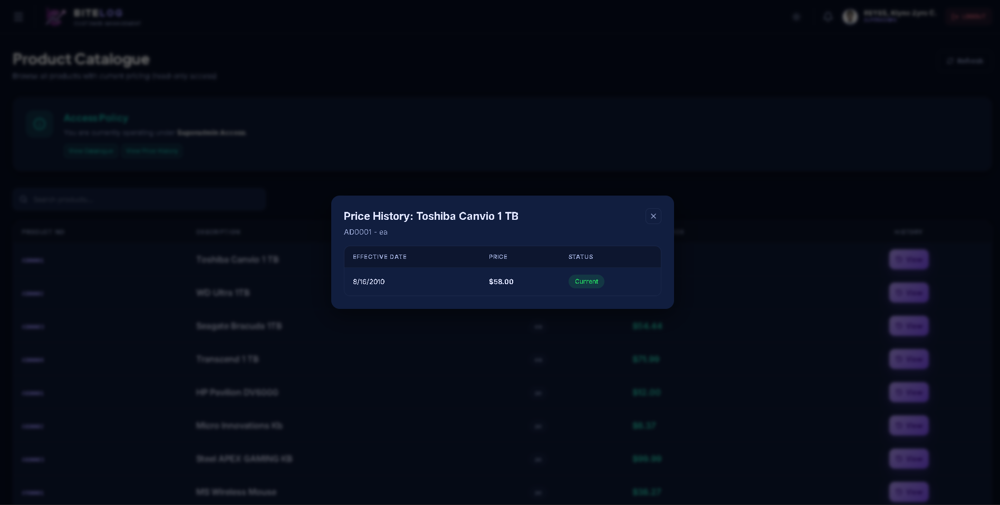

**Result:** ✅ PASS  
**Notes:** Works perfectly as intended

---

### TC-30 · RLS Blocks Direct Write to sales Table

**Steps:**
1. Press **F12** → go to **Network** tab.
2. Navigate to the Sales Transactions page and observe the API calls.
3. Alternatively, go to **Supabase Dashboard → Table Editor → sales** and attempt to click **Insert row**.

**Expected:**
- All network requests to `sales` are GET (read) only — no POST/PATCH/DELETE
- Supabase Table Editor blocks the insert attempt with an RLS error

**Screenshot:**
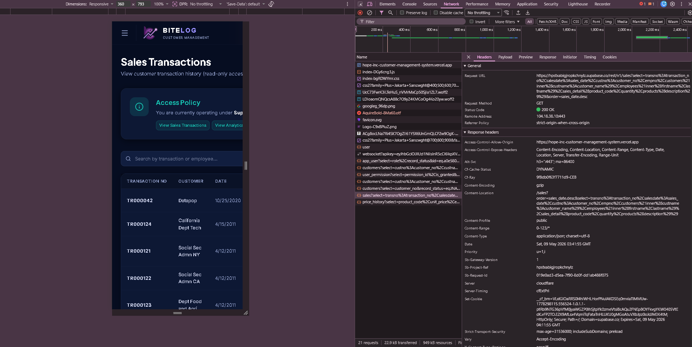

**Result:** ✅ PASS  
**Notes:** Works perfectly as intended

---

### TC-31 · No Hard Delete in Codebase

**Steps:**
1. Open the project in VS Code or terminal.
2. Run:
   ```bash
   Get-ChildItem -Path src -Recurse | Select-String -Pattern "\.delete\("
   ```
3. Also run:
   ```bash
   Get-ChildItem -Path src -Recurse | Select-String -Pattern "DELETE FROM"
   ```

**Expected:**
- Zero results — no DELETE keyword in application code

**Screenshot:**
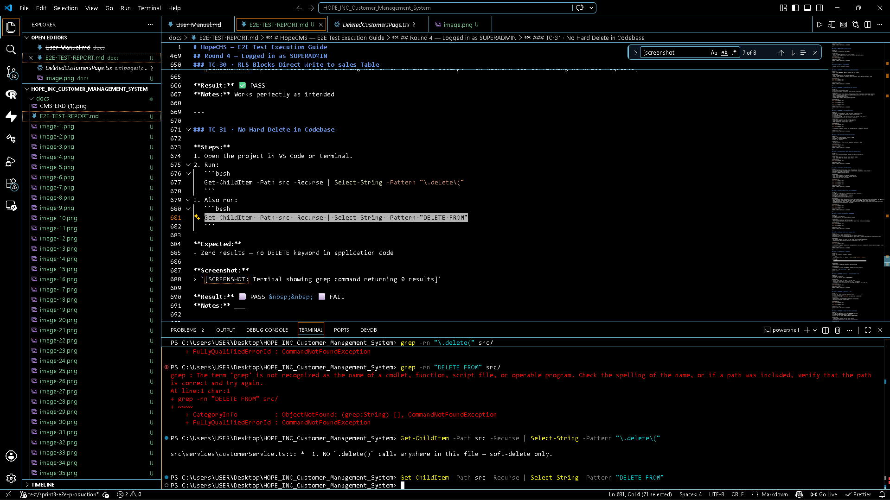

**Result:** ✅ PASS  
**Notes:** Works perfectly as intended

---

### TC-32 · SUPERADMIN Protection — Buttons Disabled in UI

**Steps:**
1. Navigate to **Users**.
2. Locate any row with Role = **SUPERADMIN**.

**Expected:**
- Actions column shows `—` (dash) — no `···` menu
- Role column shows static **SUPERADMIN** text — no dropdown
- This applies to all SUPERADMIN rows including the logged-in user's own row

**Screenshot:**
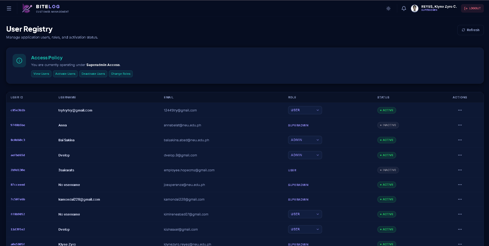

**Result:** ✅ PASS  
**Notes:** Works perfectly as intended

---

### TC-33 · SUPERADMIN — Deactivate a User

**Steps:**
1. Click `···` on an ACTIVE non-SUPERADMIN user.
2. Select **Deactivate**.
3. Confirm the dialog: *"[username] will be marked as INACTIVE."*

**Expected:**
- Status changes to **INACTIVE** immediately in the table
- User will be blocked at next login

**Screenshot:**
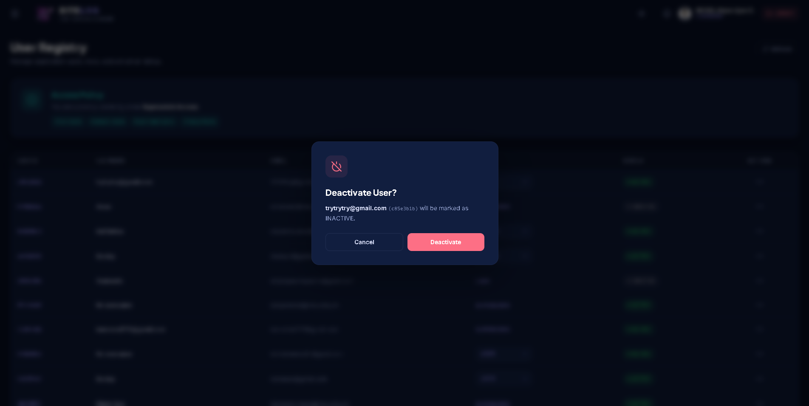

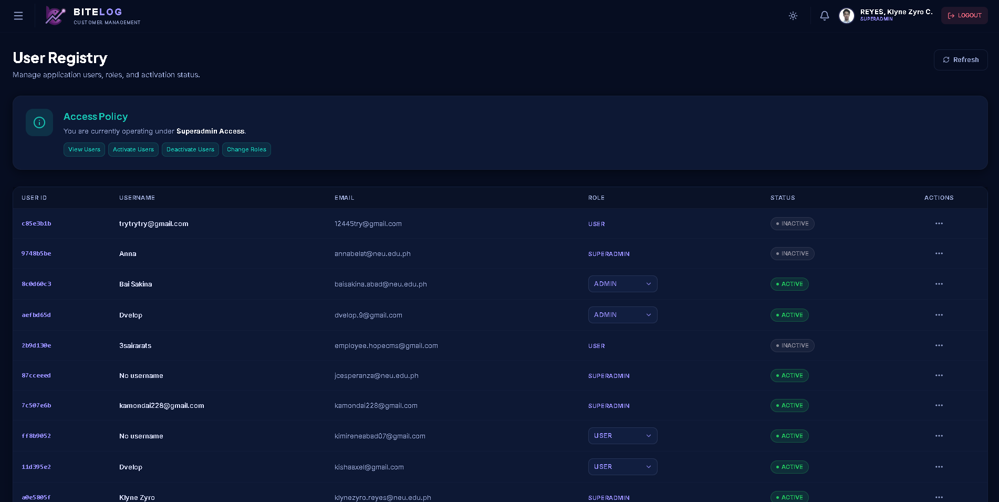

**Result:** ✅ PASS  
**Notes:** Works perfectly as intended

---

### TC-34 · SUPERADMIN — Change User Role via Dropdown

**Steps:**
1. In the User Registry, find a non-SUPERADMIN user row.
2. Click the **Role** dropdown on that row.
3. Switch the role (e.g., USER → ADMIN or ADMIN → USER).

**Expected:**
- Dropdown opens showing USER and ADMIN options
- Role updates immediately in the table after selection

**Screenshot:**
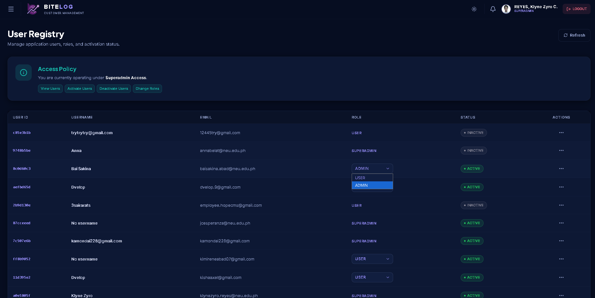

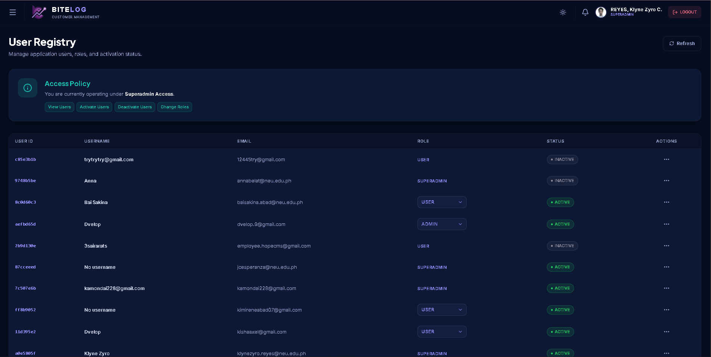

**Result:** ✅ PASS  
**Notes:** Works perfectly as intended

---

### TC-35 · Audit Logs — Full Log with Click-Through Detail

**Steps:**
1. Navigate to **Logs**.
2. Observe the log table.
3. Click any row to open the Log Details modal.

**Expected:**
- Log table shows: Date/Time, Action badge (colored), Table, User, Record ID
- Log Details modal shows: Log ID, User, Changes table with Field / Before / After columns
- Changed fields are highlighted in amber (before) and green (after)

**Screenshot:**
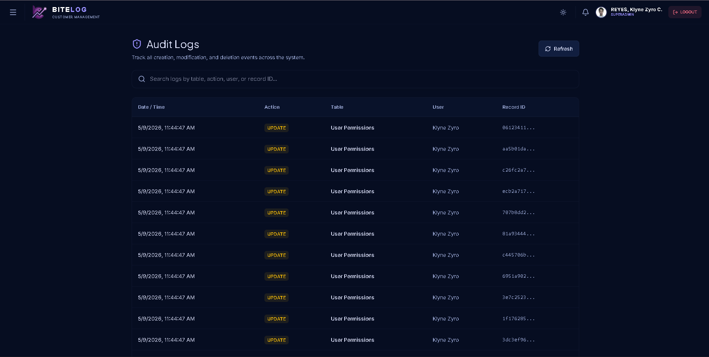

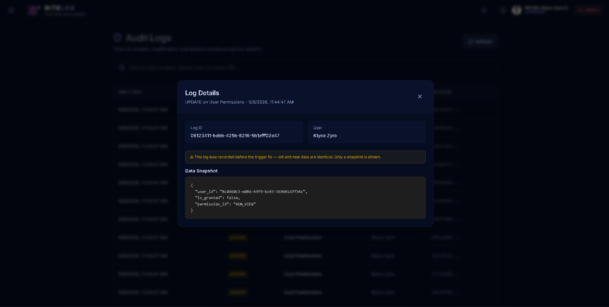

**Result:** ✅ PASS  
**Notes:** Works perfectly as intended

---

## Final Checks — Light Mode & Access Policy Banners

### TC-36 · Light Mode Toggle

**Steps:**
1. On the login page, click **Light mode** (top-right corner of the browser window).
2. When logged in, click the ☀️/🌙 icon in the navbar.

**Expected:**
- Theme switches between dark and light immediately on both pages

**Screenshot:**
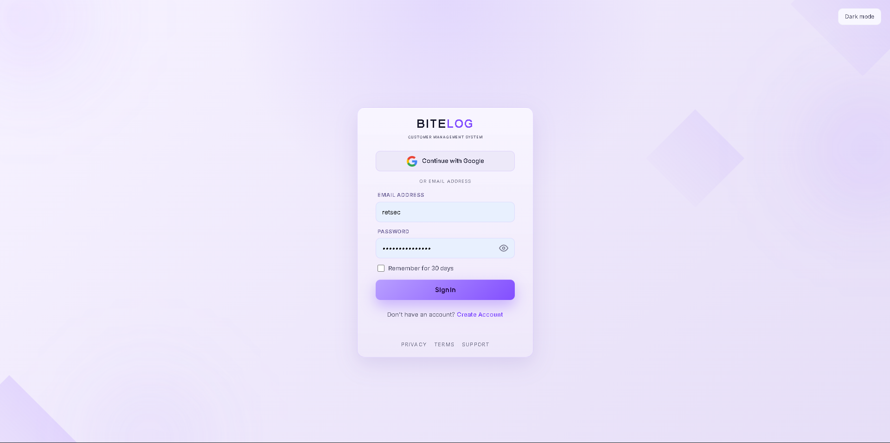

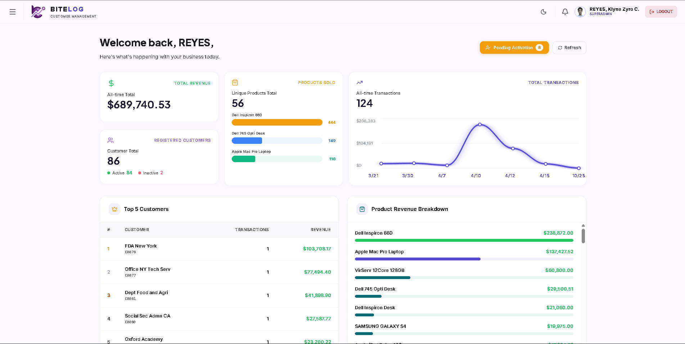

**Result:** ✅ PASS  
**Notes:** Works perfectly as intended

---

## Test Summary

| Round | Test Cases | Passed | Failed |
|-------|-----------|--------|--------|
| Round 1 — Registration & Auth | TC-01 to TC-03 | 3 | 0 |
| Round 2 — USER Role | TC-04 to TC-10 | 7 | 0 |
| Round 3 — ADMIN Role | TC-11 to TC-21 | 11 | 0 |
| Round 4 — SUPERADMIN Role | TC-22 to TC-35 | 14 | 0 |
| Final Checks | TC-36 | 1 | 0 |
| **TOTAL** | **36** | 36 | 0 |

**Overall Status:** ✅ PASS   — All 36 test cases passed

---

## Failed Test Cases Log


| TC # | Description | Failure Detail | Fixed? |
|------|-------------|----------------|--------|
| | | | |
| | | | |

---

## Sign-Off

| Role | Name | Date |
|------|------|------|
| QA Tester (M5) | Klyne Zyro Reyes | May 9, 2026 | |


---

*HopeCMS (BiteLog) Sprint 3 Final · Team BiteLog · New Era University · AY 2025–2026*