# HopeCMS — User Manual

**Project:** Hope, Inc. Customer Management System (BiteLog)
**Version:** Sprint 3 Final
**Prepared by:** M5 – QA / Documentation Specialist
**Date:** ___________________________
**Live URL:** https://hope-inc-customer-management-system.vercel.app

---

## Table of Contents

1. [Introduction & Role Overview](#1-introduction--role-overview)
2. [Creating an Account](#2-creating-an-account)
3. [Logging In](#3-logging-in)
4. [Customer Registry](#4-customer-registry)
5. [Sales Transactions](#5-sales-transactions)
6. [Product Catalogue](#6-product-catalogue)
7. [Dashboard (SUPERADMIN only)](#7-dashboard-superadmin-only)
8. [User Registry](#8-user-registry)
9. [Deleted Customers](#9-deleted-customers)
10. [Audit Logs](#10-audit-logs)
11. [Light Mode Toggle](#11-light-mode-toggle)
12. [Role Permissions Summary](#12-role-permissions-summary)

---

## 1. Introduction & Role Overview

**HopeCMS** (branded as **BiteLog**) is a web-based Customer Management System for Hope, Inc. It provides a centralized interface for managing customer records, reviewing purchase histories, and monitoring sales performance — with strictly enforced role-based access control at both the UI and database level.

| Role | Who is this? | Landing page after login |
|------|-------------|--------------------------|
| **SUPERADMIN** | System Administrator | Dashboard |
| **ADMIN** | Sales Manager | Customer Registry |
| **USER** | Sales Staff | Customer Registry |

> 🔒 **Important:** The Sales, Products, and Price History data are **read-only for every role**, including SUPERADMIN. No add, edit, or delete buttons exist on those pages. This is enforced in both the UI and at the database level via Row-Level Security (RLS).

---

## 2. Creating an Account

### 2.1 Registration via Email

1. Navigate to the HopeCMS URL. You will see the **BiteLog** login card.
2. Click **Create Account** at the bottom of the login card (*"Don't have an account? Create Account"*).

   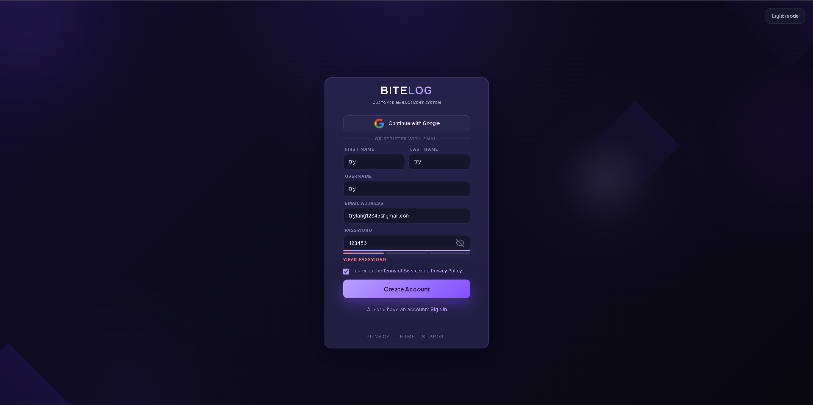

3. The registration form appears. Fill in all required fields:

   | Field | Notes |
   |-------|-------|
   | First Name | Your given name |
   | Last Name | Your family name |
   | Username | Your display name in the system |
   | Email Address | Your company or personal email |
   | Password | A strength indicator bar appears below as you type |

   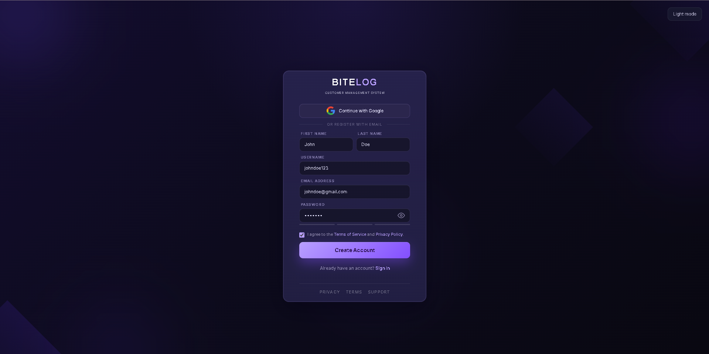

4. Check the **"I agree to the Terms of Service and Privacy Policy"** checkbox.
5. Click **Create Account** (purple button).
6. A confirmation email is sent to your address. Open it and click the verification link.

   > `[SCREENSHOT: Email confirmation message — placeholder pending rate-limit reset]`

7. After confirming, return to the login page. Attempting to sign in will show a pending-activation message — your account starts as **USER / INACTIVE** and cannot be used until activated by an ADMIN or SUPERADMIN.

   > `[SCREENSHOT: Login page showing pending activation message]`

> ✉️ Contact your Sales Manager (ADMIN) and provide your registered email. They will activate your account from the User Registry.

---

### 2.2 Registration via Google

1. On the login page, click **Continue with Google**.

   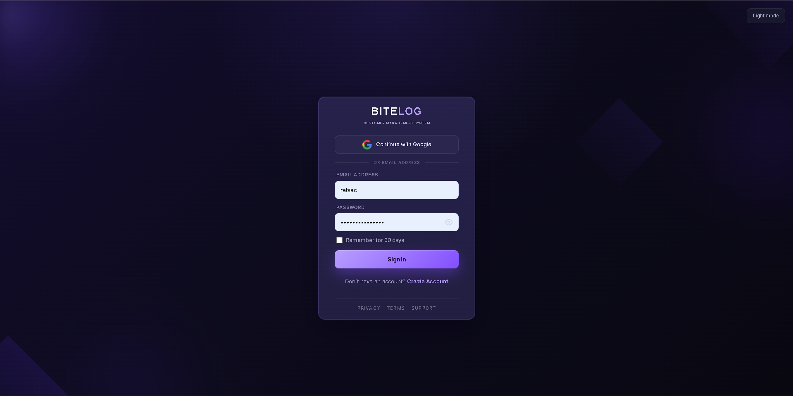

2. The Google account picker appears. Select the account you want to use.
3. You are redirected back to HopeCMS. Your account is automatically created as **USER / INACTIVE**.
4. You will see the pending activation message. Contact your Sales Manager to request activation.

---

## 3. Logging In

### 3.1 Sign In with Email

1. On the login page, enter your **Email Address** and **Password**.
2. Optionally tick **Remember for 30 days** to stay signed in.
3. Click **Sign In**.

   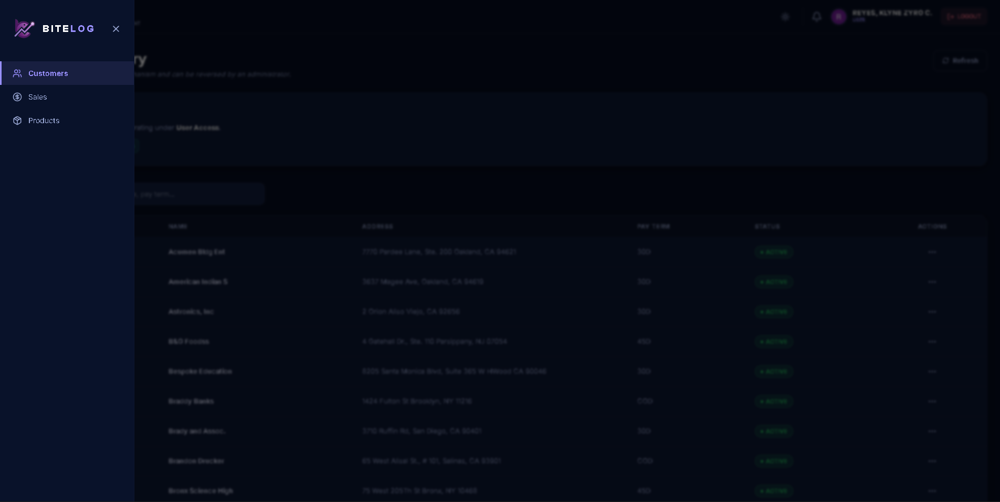

- If **ACTIVE** → you are redirected to your landing page.
- If **INACTIVE** → you see the pending activation message and cannot proceed.

### 3.2 Sign In with Google

1. Click **Continue with Google**.
2. Select your registered Google account.
3. If active, you are redirected to your landing page automatically.

### 3.3 Logging Out

Click the **LOGOUT** button in the top-right corner of the navigation bar. You are returned to the login page immediately — no need to click on your avatar or username first.

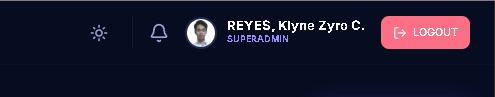

---

## 4. Customer Registry

Navigate to **Customers** in the sidebar. This is the default landing page for ADMIN and USER after login.

### 4.1 Viewing Customers (All Roles)

The **Customer Registry** shows a paginated table of customers. At the top of the page is an **Access Policy** banner summarizing what your role can do on this page.

**What the table shows:**

| Column | USER | ADMIN | SUPERADMIN |
|--------|:----:|:-----:|:----------:|
| Customer ID | ✅ | ✅ | ✅ |
| Name | ✅ | ✅ | ✅ |
| Address | ✅ | ✅ | ✅ |
| Pay Term | ✅ | ✅ | ✅ |
| Status | ✅ | ✅ | ✅ |
| Stamp (audit trail) | ❌ | ✅ | ✅ |
| Actions (`···`) | ✅ | ✅ | ✅ |

The **Stamp** column records the last action on that record, e.g.:
`Updated by ADMIN:Bai Sakina B. A @ 2026-05-03 12:22`

**Searching:** Use the search bar to filter by name, address, customer code, or pay term. The bar above the table shows the live count, e.g., *"2 of 84 shown"*.

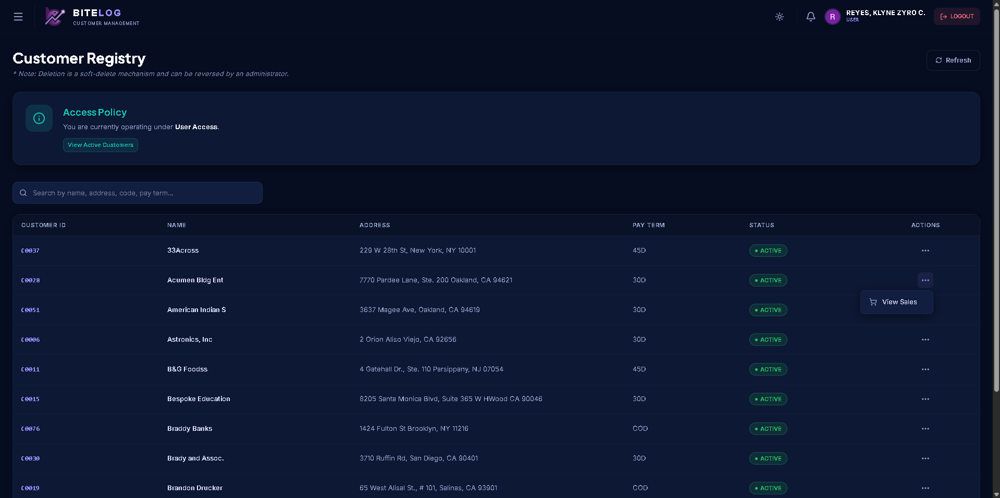

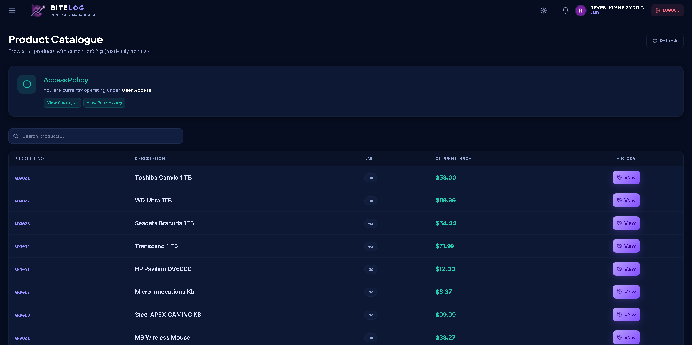

> ⚠️ **USER accounts see ACTIVE customers only.** INACTIVE (soft-deleted) customers are completely invisible — they don't appear in the list or search results.

---

### 4.2 Adding a Customer (ADMIN / SUPERADMIN)

1. Click the **+ Add Customer** button at the top-right of the page.

   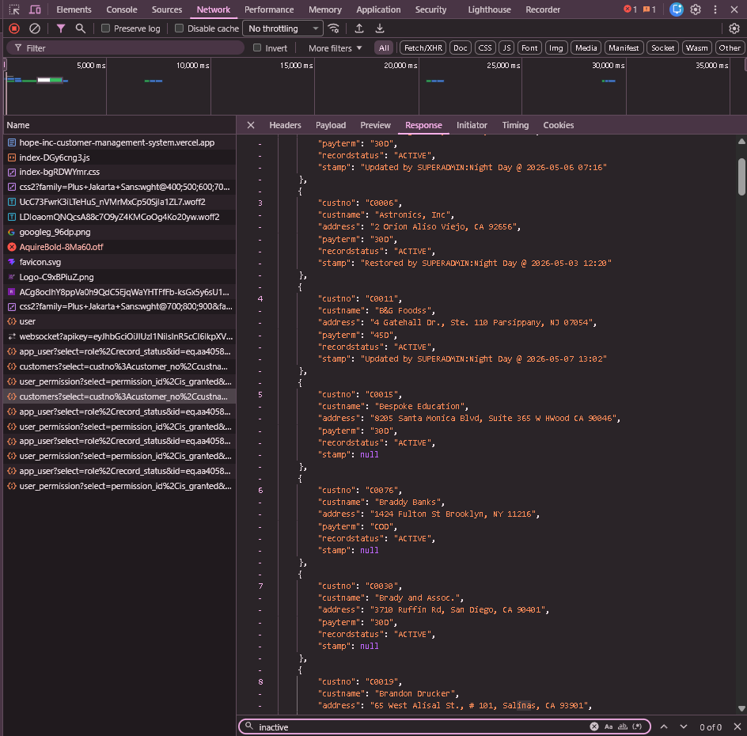

2. The **Add New Customer** modal opens:

   | Field | Notes |
   |-------|-------|
   | Customer No | **Auto-assigned** — displayed as "Auto assigned", cannot be changed |
   | Customer Name | Required |
   | Address | Required |
   | Payment Term | Select from: COD, 30D, or 45D |

   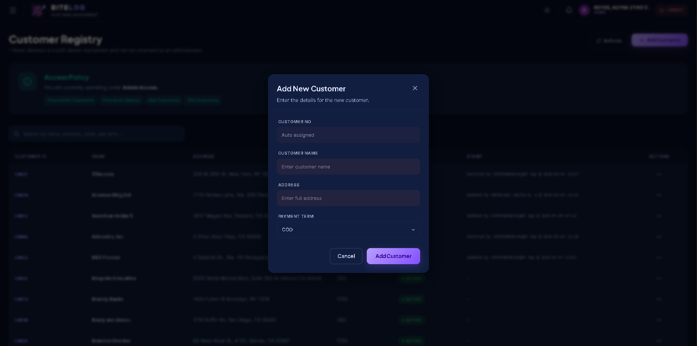

3. Click **Add Customer**. The new record appears in the table immediately.

---

### 4.3 Editing a Customer (ADMIN / SUPERADMIN)

1. Click the **`···`** (actions) button on the customer row you want to edit.
2. Select **Edit**.

   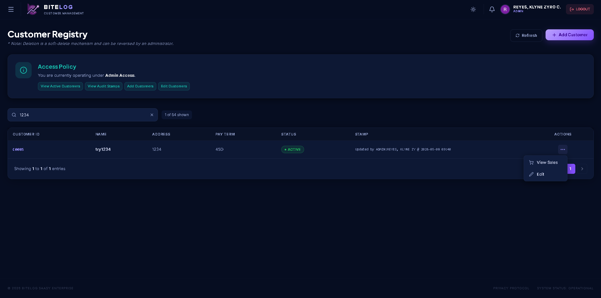

3. The edit form opens pre-filled with the current values. Make your changes.
4. Click **Save**. The row updates immediately; the Stamp records who made the change and when.

---

### 4.4 Viewing Sales Inline (All Roles)

You can expand a customer's full sales history directly within the Customer Registry.

1. 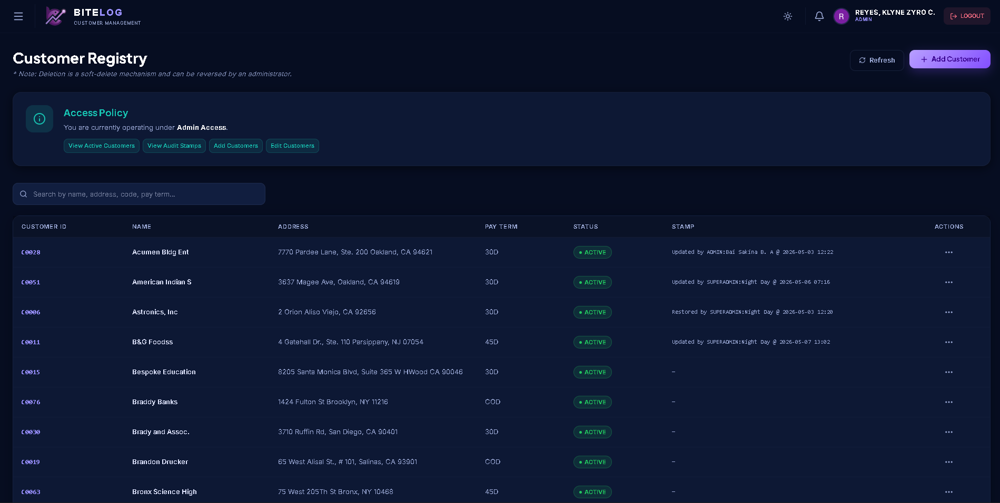
2. Select **View Sales**.

   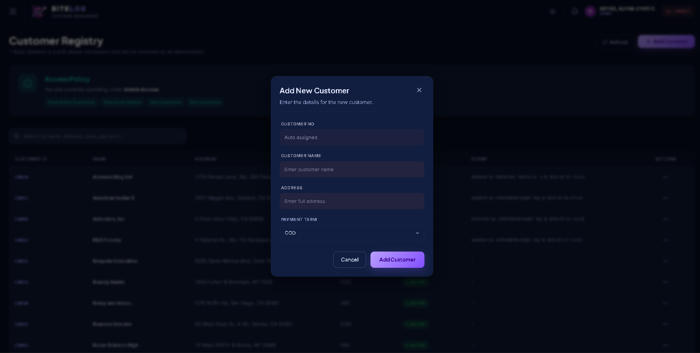

3. A **Sales History** panel expands inline below the customer row, showing transactions:

   | Column | Description |
   |--------|-------------|
   | Transaction No | e.g., TR000064 |
   | Date | Sale date |
   | Facilitated By | Employee who processed the sale |
   | Grand Total | Total value of the transaction |

4. Each transaction also shows its **line items** directly beneath it:

   | Column | Description |
   |--------|-------------|
   | Product | Product name + product code in parentheses |
   | Qty | Quantity |
   | Price | Unit price from price history |
   | Subtotal | Qty × Price |

   A green **Total Sales** row appears at the bottom.

   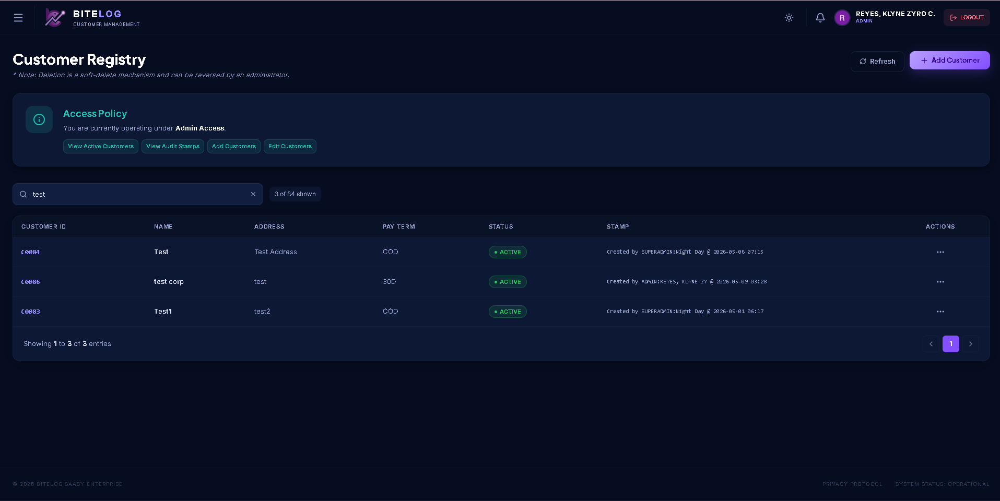

5. To collapse, click **`···`** again and select **Hide Sales**.

> 🔒 Read-only — no add, edit, or delete controls appear anywhere in the sales view.

---

### 4.5 Soft-Deleting a Customer (SUPERADMIN only)

HopeCMS **never permanently deletes** customer records. Soft-deleting sets the customer to `INACTIVE`, hiding them from USER accounts while preserving all historical data.

1. Click **`···`** on the customer row. *(The Delete option only appears for SUPERADMIN.)*
2. Select **Delete**.
3. The **Delete Customer** dialog appears:
   > *"This will soft-delete the customer "[Name]". The record will be hidden from regular users but can be recovered by Admin or SuperAdmin."*

   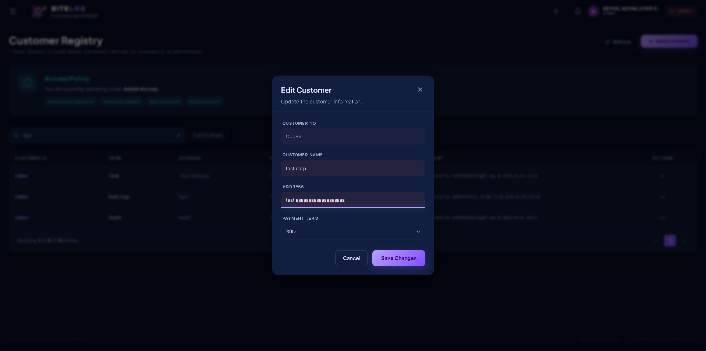

4. Click **Delete** (red) to confirm. The customer vanishes from the list.
5. The record can be recovered at any time from **Deleted Customers** in the sidebar.

---

## 5. Sales Transactions

Navigate to **Sales** in the sidebar. Available to all roles.

- **Page title:** Sales Transactions
- **Subtitle:** *"View customer transaction history (read-only access)"*
- **Access Policy** reflects your role (e.g., SUPERADMIN sees: View Sales Transactions, View Analytics)

**Search & Filter:** Search by transaction number or employee name. Use the **All Categories / Customers** dropdown to filter to a specific customer.

**Table columns:** Transaction No, Customer, Date, Facilitated By, Total, Actions

**Viewing line items:**
1. Click **View Details** on any transaction row.
2. The row expands showing **Transaction Details** inline:
   - Columns: Product Code, Description, Qty, Unit Price, Total
   - *"Total Items: X"* shown top-right of the expanded panel
3. Click **Hide Details** to collapse.

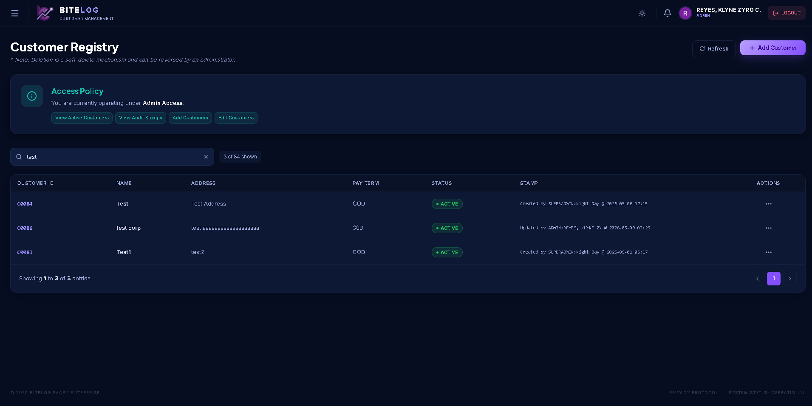

> 🔒 **Read-only for all roles.** No add, edit, or delete buttons exist on this page.

---

## 6. Product Catalogue

Navigate to **Products** in the sidebar. Available to all roles.

- **Page title:** Product Catalogue
- **Subtitle:** *"Browse all products with current pricing (read-only access)"*
- **Access Policy** shows: View Catalogue, View Price History

**Table columns:** Product No, Description, Unit, Current Price, History

**Viewing price history:**
1. Click the **View** button in the **History** column of any product row.
2. The **Price History** modal opens with the product name and code as the title (e.g., *"Price History: Toshiba Canvio 1 TB — AD0001 · ea"*).
3. The table inside shows: **Effective Date**, **Price**, **Status** — the current price has a green **Current** badge.

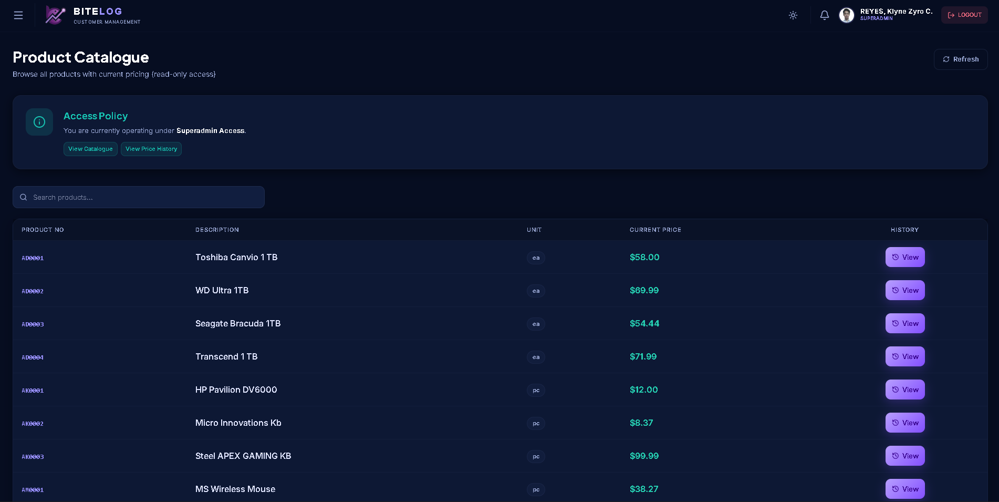

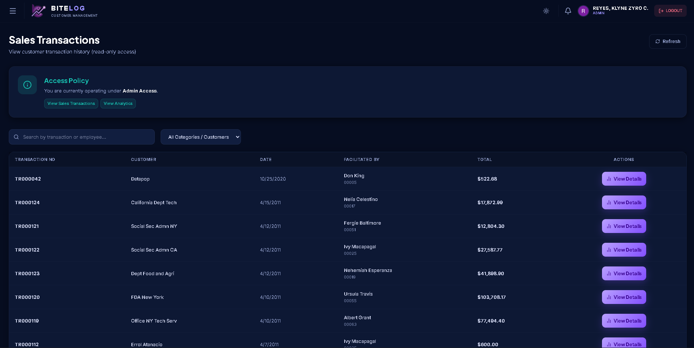

> 🔒 **Read-only for all roles.** No add, edit, or delete buttons exist on this page.

---

## 7. Dashboard (SUPERADMIN only)

Navigate to **Dashboard** in the sidebar. This is the landing page for SUPERADMIN after login. ADMIN and USER do not have access to this page.

### Summary Cards

| Card | What it shows |
|------|--------------|
| **Total Revenue** | All-time revenue total (e.g., $689,740.53) |
| **Products Sold** | Unique product count + top 3 products by qty (bar chart) |
| **Total Transactions** | All-time transaction count + line chart over time |
| **Registered Customers** | Total customers with Active / Inactive breakdown |

### Pending Activation

A yellow **Pending Activation** button with a count badge appears in the top-right of the Dashboard. Clicking it opens a modal listing all **INACTIVE** accounts awaiting activation, showing each user's name, email, and role + status badge.

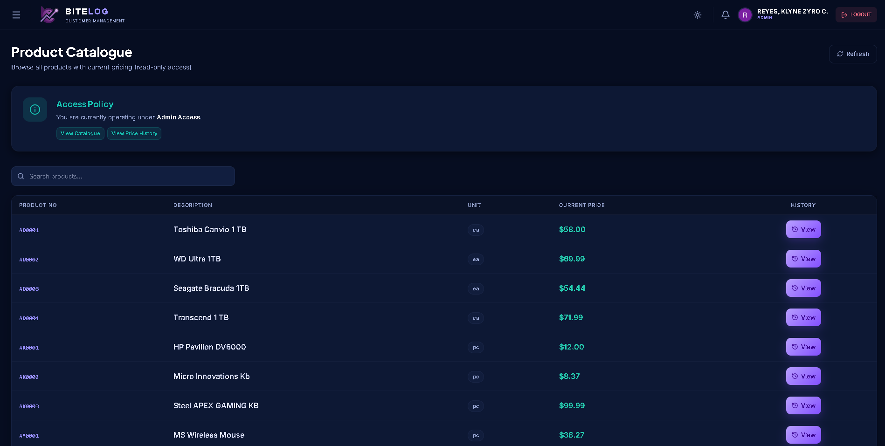

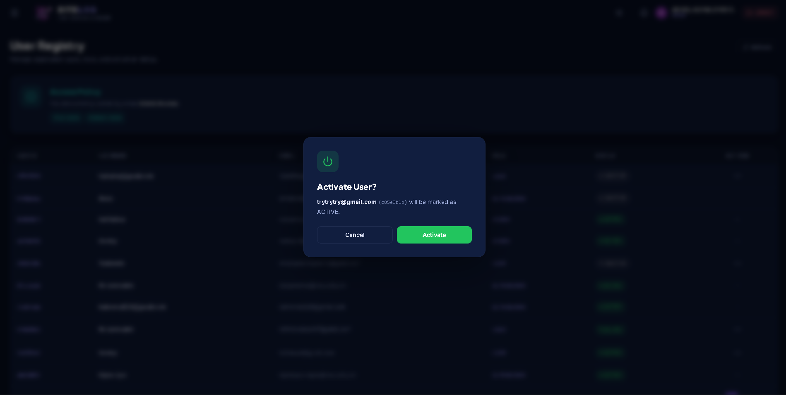

### Top 5 Customers

A ranked table: Rank (#), Customer Name + ID, Transactions count, Revenue.

### Product Revenue Breakdown

A scrollable list of all products by total revenue with colored bar indicators.

### Customer Sales Summary

A paginated table at the bottom showing all customers with: Customer No, Customer Name, Transactions count, Total Revenue, Share % (with mini bar indicator).

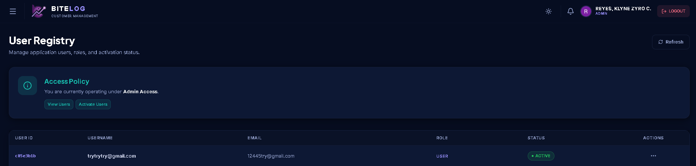

---

## 8. User Registry

Navigate to **Users** in the sidebar. Available to **ADMIN** and **SUPERADMIN**.

- **Page title:** User Registry
- **Subtitle:** *"Manage application users, roles, and activation status."*

**Table columns:** User ID (truncated), Username, Email, Role, Status, Actions (`···`)

---

### 8.1 ADMIN — Activate & View Permissions

**Access Policy shows:** View Users, Activate Users

For non-SUPERADMIN rows, clicking `···` shows:
- **View Permissions** — opens the read-only Permissions modal
- **Activate** — only appears on INACTIVE accounts

> ❌ ADMIN **cannot deactivate** users. No Deactivate option appears in the ADMIN menu at all.

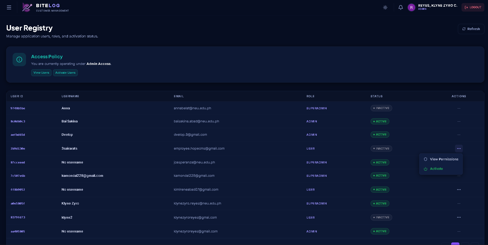

**Activating a user:**
1. Click `···` → **Activate** on an INACTIVE user row.
2. The **Activate User?** dialog appears:
   > *"[username] ([id]) will be marked as ACTIVE."*
   - Buttons: **Cancel** | **Activate** (green)
3. Click **Activate**. The status changes to ACTIVE immediately.

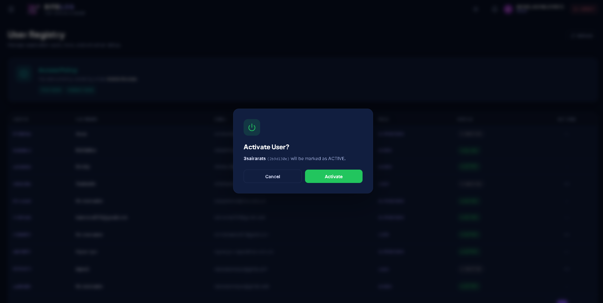

**Viewing permissions (read-only):**
1. Click `···` → **View Permissions**.
2. The **Permissions** modal opens — the **Read-only** badge appears in the top-right corner.
3. There are 4 tabs: **Customer**, **Sales**, **Product**, **Admin**.
4. Each tab shows individual permission toggles indicating ON/OFF. The toggles cannot be changed by ADMIN.
   - Customer tab example: View Customers (CUST_VIEW), Add Customer (CUST_ADD), Edit Customer (CUST_EDIT), Soft Delete Customer (CUST_DEL), View Inactive Customers (CUST_VIEW_INACTIVE), Recover Soft-Deleted Customers (CUST_RECOVER), View Audit Stamps (CUST_STAMP)

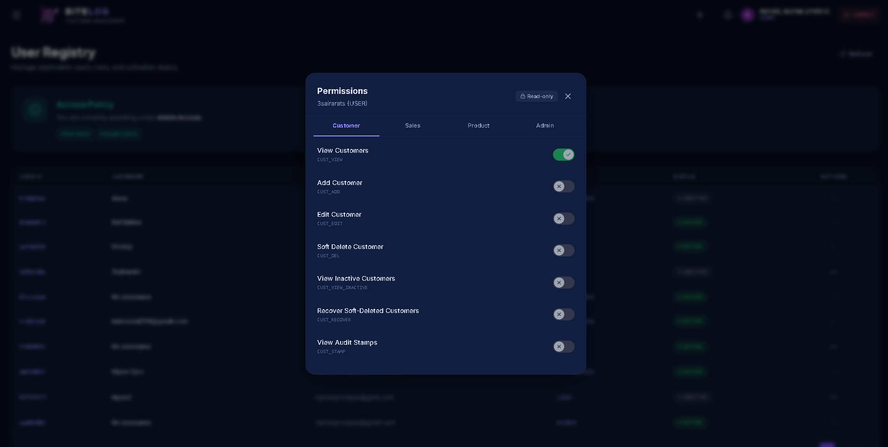

**SUPERADMIN rows:** Show `—` in the Actions column. No menu appears.

---

### 8.2 SUPERADMIN — Full User Management

**Access Policy shows:** View Users, Activate Users, Deactivate Users, Change Roles

For non-SUPERADMIN rows, clicking `···` shows:
- **View Permissions**
- **Deactivate** (for ACTIVE accounts) or **Activate** (for INACTIVE accounts)

The **Role** column for non-SUPERADMIN users shows an **inline dropdown** (USER / ADMIN) that can be changed directly in the table.

**Deactivating a user:**
1. Click `···` → **Deactivate** on an ACTIVE user.
2. The **Deactivate User?** dialog appears:
   > *"[username] ([id]) will be marked as INACTIVE."*
   - Buttons: **Cancel** | **Deactivate** (red/pink)
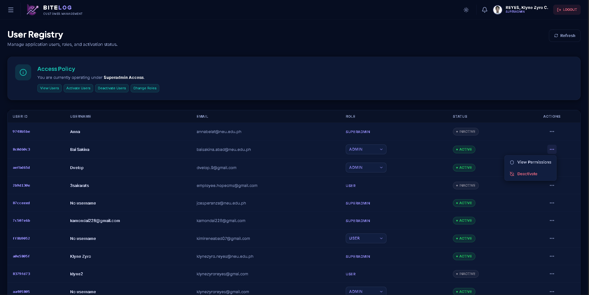
3. Click **Deactivate**. The status changes to INACTIVE and the user is blocked at next login.

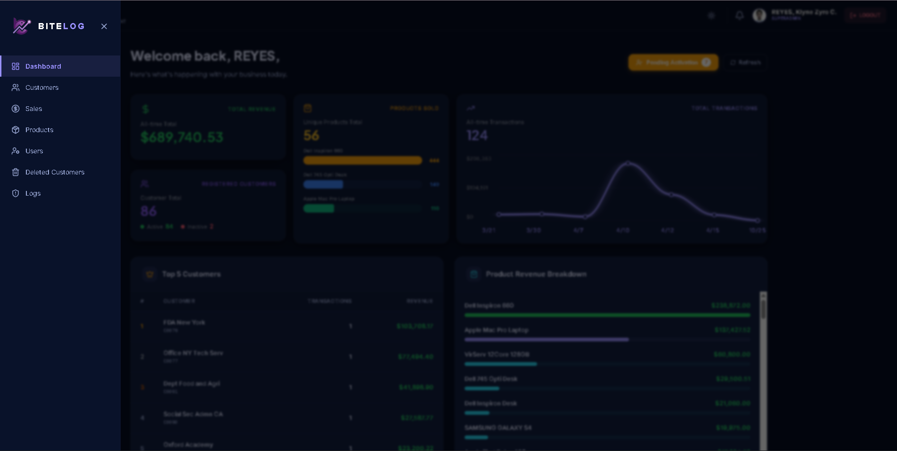

**Changing a user's role:**
1. Click the **dropdown** in the Role column of a non-SUPERADMIN row.
2. Select **USER** or **ADMIN**.
3. The change applies immediately.

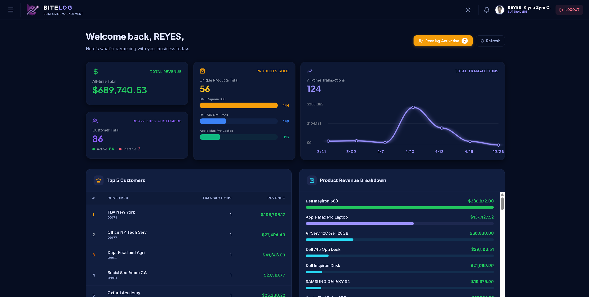

**SUPERADMIN rows:** Show `—` in Actions for all users. SUPERADMIN accounts cannot be modified by anyone in the system.

---

## 9. Deleted Customers

Navigate to **Deleted Customers** in the sidebar. Available to **ADMIN** and **SUPERADMIN**.

- **Page title:** Deleted Customers
- **Subtitle:** *"View and manage soft-deleted customer records. These records are hidden from regular users but remain in the database for auditing and recovery."*
- **Access Policy (SUPERADMIN):** View Archived Customers, View Audit Stamps, Restore Customers

**Table columns:** Customer ID, Name, Address, Pay Term, Status (INACTIVE badge), Stamp, **Restore** button (green)

The Stamp shows the deletion audit, e.g.:
`Deleted [ACTIVE] by SUPERADMIN:REYES, Klyne Zy @ 2026-05-08`

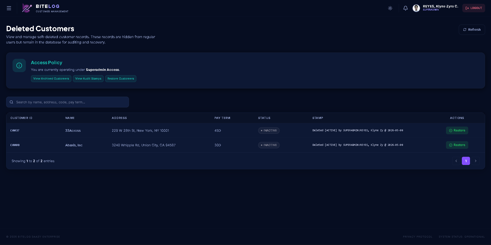

**Restoring a customer:**
1. Find the customer to restore. Click the green **Restore** button on their row.
2. The **Restore Customer?** dialog appears:
   > *"[Name] ([C00xx]) will be restored to its previous state (ACTIVE)."*
   - Buttons: **Cancel** | **Restore** (green)

   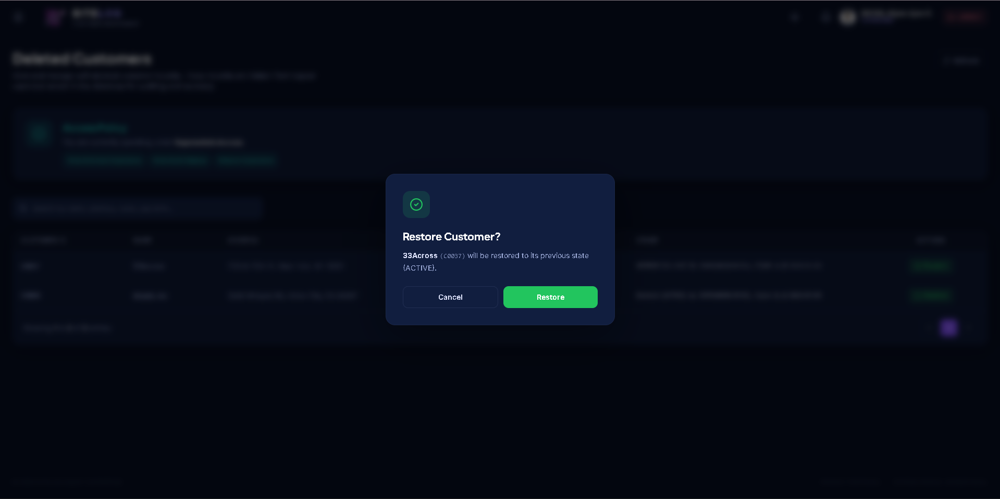

3. Click **Restore**. The customer reappears in the main Customer Registry for all users.

> ⚠️ USER accounts do not have access to this page. The sidebar link is hidden and direct URL navigation is blocked.

---

## 10. Audit Logs

Navigate to **Logs** in the sidebar. Available to **ADMIN** and **SUPERADMIN**.

- **Page title:** Audit Logs
- **Subtitle:** *"Track all creation, modification, and deletion events across the system."*

**Search:** Filter by table name, action type, user, or record ID.

**Table columns:** Date / Time, Action (colored badge), Table, User, Record ID (truncated)

**Action badge colors:**

| Badge | Color |
|-------|-------|
| DELETED | Red |
| RESTORED | Green |
| ACTIVATED | Green |
| DEACTIVATED | Orange |
| UPDATED | Amber |
| INSERT / UPDATE | Purple / Amber |

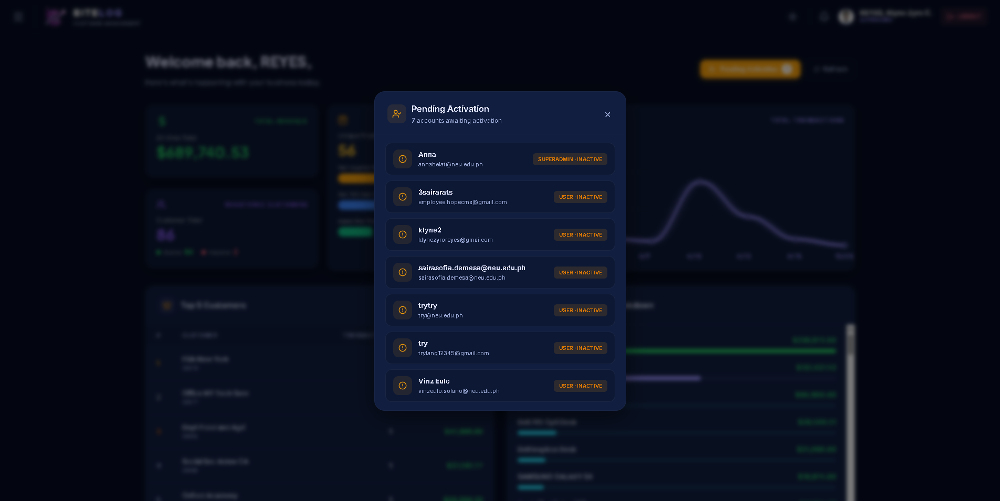

**Viewing log details:**
1. Click any row in the log table.
2. The **Log Details** modal opens showing:
   - **Log ID** (full UUID) and **User** who performed the action
   - A **Changes** table: **Field** / **Before** (orange/amber) / **After** (green) — changed fields are highlighted; unchanged fields show the same value in both columns

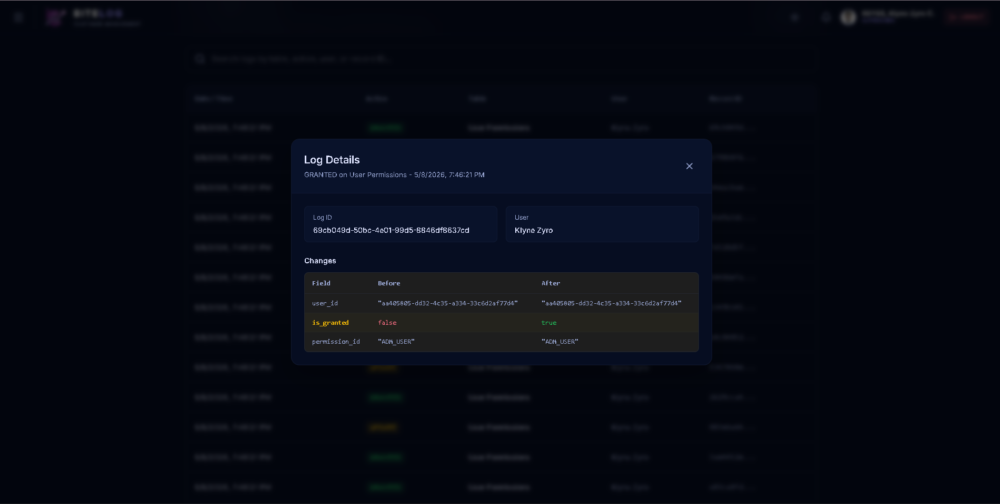

---

## 11. Light Mode Toggle

HopeCMS supports both **Dark Mode** (default) and **Light Mode**.

- **On the login and registration pages:** a **"Light mode"** button appears in the **top-right corner** of the browser window.
- **When logged in:** a ☀️/🌙 icon appears in the **navigation bar** (top-right area, next to the bell icon).

Click the icon to toggle between modes. The switch is instant with no page reload.

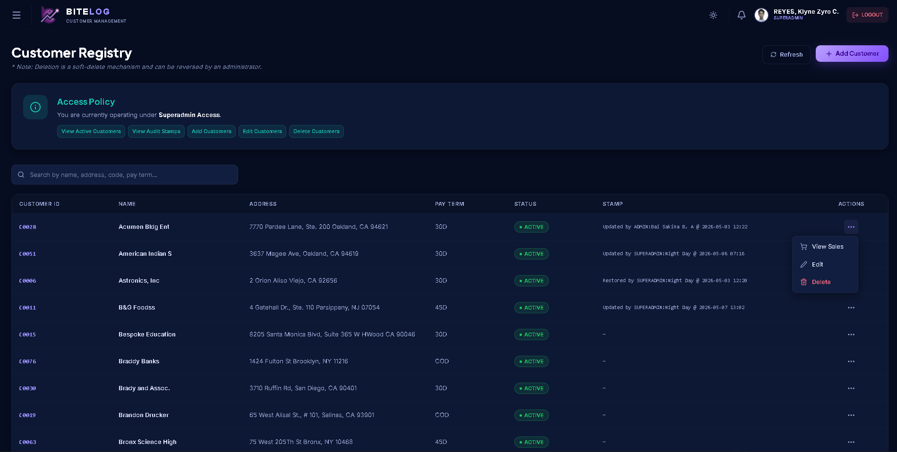

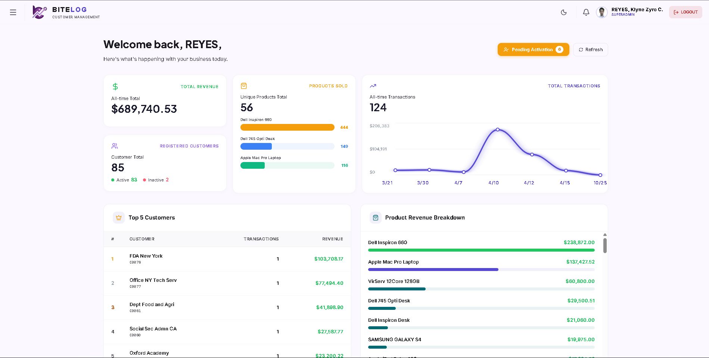

---

## 12. Role Permissions Summary

| Feature | USER | ADMIN | SUPERADMIN |
|---------|:----:|:-----:|:----------:|
| **Sidebar Pages** | | | |
| Dashboard | ❌ | ❌ | ✅ |
| Customers | ✅ | ✅ | ✅ |
| Sales | ✅ | ✅ | ✅ |
| Products | ✅ | ✅ | ✅ |
| Users | ❌ | ✅ | ✅ |
| Deleted Customers | ❌ | ✅ | ✅ |
| Logs | ❌ | ✅ | ✅ |
| **Customer Registry** | | | |
| View ACTIVE customers | ✅ | ✅ | ✅ |
| View INACTIVE customers | ❌ | ✅ | ✅ |
| View Stamp / audit column | ❌ | ✅ | ✅ |
| View Sales inline (View Sales) | ✅ | ✅ | ✅ |
| Add customer | ❌ | ✅ | ✅ |
| Edit customer | ❌ | ✅ | ✅ |
| Soft-delete customer | ❌ | ❌ | ✅ |
| **Sales / Products / Prices** | | | |
| View transactions & line items | ✅ | ✅ | ✅ |
| View product catalogue | ✅ | ✅ | ✅ |
| View price history | ✅ | ✅ | ✅ |
| Add / Edit / Delete (any of the above) | ❌ | ❌ | ❌ |
| **Deleted Customers** | | | |
| View soft-deleted customers | ❌ | ✅ | ✅ |
| Restore customer | ❌ | ✅ | ✅ |
| **User Registry** | | | |
| View users | ❌ | ✅ | ✅ |
| View user permissions | ❌ | ✅ (read-only) | ✅ (read-only) |
| Activate users | ❌ | ✅ | ✅ |
| Deactivate users | ❌ | ❌ | ✅ |
| Change user roles | ❌ | ❌ | ✅ |
| Modify SUPERADMIN accounts | ❌ | ❌ | ❌ |
| **Dashboard** | | | |
| Business analytics | ❌ | ❌ | ✅ |
| Pending Activation widget | ❌ | ❌ | ✅ |

---

*HopeCMS (BiteLog) Sprint 3 Final · Team BiteLog · New Era University · AY 2025–2026*